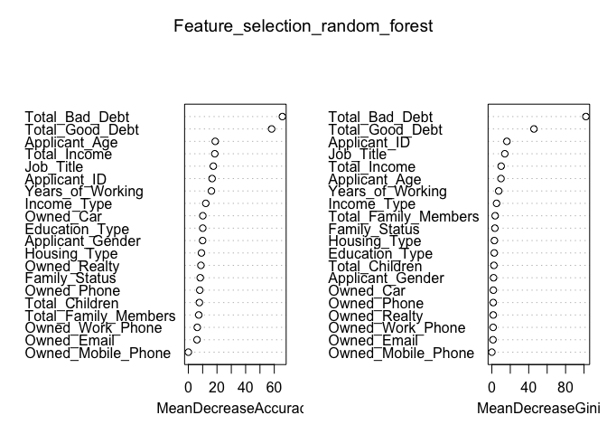

Credit card approval analysis
================
Owen Kim
2024-12-11

## Team Members

- Owen Kim - <owenk@iastate.edu>

### Credit Approval Dataset

- **Source**: <https://archive.ics.uci.edu/dataset/27/credit+approval>
  Dataset from bank in Japan, rest of the informations are confidential.
- **Attributes**: Contains examples of individuals who were granted or
  denied credit, with attributes such as Gender, Age, Debt, Married,
  BankCustomer, Industry, Ethnicity, YearsEmployed, PriorDefault,
  Employed, CreditScore, DriversLicense, Citizen, ZipCode, Income, and
  Approved.
- **Relevance**: This dataset provides real-world examples and domain
  theory for credit screening.

### First Data Cleaning Steps

- **Handle Missing Values**: Identify and impute or remove missing
  values.
- **Convert Categorical Variables**: Encode categorical variables using
  techniques such as one-hot encoding or label encoding.
- **Normalize Continuous Variables**: Normalize continuous variables to
  ensure they are on a similar scale.

### Question to be addressed

1.  Feature Importance in Credit Approval
2.  Demographic Analysis
3.  Model Comparison

``` r
library(dplyr)
```

    ## 
    ## Attaching package: 'dplyr'

    ## The following objects are masked from 'package:stats':
    ## 
    ##     filter, lag

    ## The following objects are masked from 'package:base':
    ## 
    ##     intersect, setdiff, setequal, union

``` r
data <- read.csv("Application_Data.csv")
glimpse(data)
```

    ## Rows: 25,128
    ## Columns: 21
    ## $ Applicant_ID         <int> 5008806, 5008808, 5008809, 5008810, 5008811, 5008…
    ## $ Applicant_Gender     <chr> "M      ", "F      ", "F      ", "F      ", "F   …
    ## $ Owned_Car            <int> 1, 0, 0, 0, 0, 1, 1, 1, 1, 1, 1, 1, 1, 1, 0, 0, 0…
    ## $ Owned_Realty         <int> 1, 1, 1, 1, 1, 1, 1, 1, 1, 1, 1, 1, 0, 0, 1, 1, 1…
    ## $ Total_Children       <int> 0, 0, 0, 0, 0, 0, 0, 0, 0, 0, 0, 0, 0, 0, 0, 0, 0…
    ## $ Total_Income         <int> 112500, 270000, 270000, 270000, 270000, 270000, 1…
    ## $ Income_Type          <chr> "Working                                         …
    ## $ Education_Type       <chr> "Secondary / secondary special                   …
    ## $ Family_Status        <chr> "Married                                         …
    ## $ Housing_Type         <chr> "House / apartment                               …
    ## $ Owned_Mobile_Phone   <int> 1, 1, 1, 1, 1, 1, 1, 1, 1, 1, 1, 1, 1, 1, 1, 1, 1…
    ## $ Owned_Work_Phone     <int> 0, 0, 0, 0, 0, 1, 0, 0, 0, 0, 0, 0, 0, 0, 0, 0, 0…
    ## $ Owned_Phone          <int> 0, 1, 1, 1, 1, 1, 0, 0, 0, 0, 0, 0, 0, 0, 1, 1, 1…
    ## $ Owned_Email          <int> 0, 1, 1, 1, 1, 1, 0, 0, 0, 0, 0, 0, 0, 0, 0, 0, 0…
    ## $ Job_Title            <chr> "Security staff                                  …
    ## $ Total_Family_Members <int> 2, 1, 1, 1, 1, 2, 2, 2, 2, 2, 2, 2, 2, 2, 2, 2, 2…
    ## $ Applicant_Age        <int> 59, 53, 53, 53, 53, 47, 49, 49, 49, 49, 49, 49, 3…
    ## $ Years_of_Working     <int> 4, 9, 9, 9, 9, 3, 4, 4, 4, 4, 4, 4, 4, 4, 5, 5, 5…
    ## $ Total_Bad_Debt       <int> 0, 0, 0, 0, 0, 0, 0, 0, 0, 0, 0, 0, 1, 7, 2, 2, 2…
    ## $ Total_Good_Debt      <int> 30, 5, 5, 27, 39, 6, 8, 9, 9, 9, 5, 4, 25, 23, 30…
    ## $ Status               <int> 1, 1, 1, 1, 1, 1, 1, 1, 1, 1, 1, 1, 1, 1, 1, 1, 1…

``` r
library(randomForest)
```

    ## randomForest 4.7-1.2

    ## Type rfNews() to see new features/changes/bug fixes.

    ## 
    ## Attaching package: 'randomForest'

    ## The following object is masked from 'package:dplyr':
    ## 
    ##     combine

``` r
categorical_columns <- c("Owned_Car", "Owned_Realty", "Owned_Mobile_Phone", "Owned_Work_Phone", "Owned_Phone", "Owned_Email", "Status") 

char_columns <- c("Applicant_Gender", "Income_Type", "Education_Type", "Family_Status", "Housing_Type", "Job_Title") 

for (col in categorical_columns) { data[[col]] <- as.factor(data[[col]]) } 

for (col in char_columns) { data[[col]] <- as.factor(data[[col]]) } 

Feature_selection_random_forest <- randomForest(Status ~ ., data = data, importance = TRUE)
importance(Feature_selection_random_forest)
```

    ##                              0         1 MeanDecreaseAccuracy MeanDecreaseGini
    ## Applicant_ID         13.108411 13.022310            16.579367        16.293929
    ## Applicant_Gender     10.992923  8.231400             9.948469         1.828735
    ## Owned_Car             9.992430  7.004336            10.098907         1.613206
    ## Owned_Realty          6.975075  6.081004             8.778498         1.498381
    ## Total_Children        6.131265  5.973539             7.704504         2.229854
    ## Total_Income         14.167524 14.995144            18.476365        10.097857
    ## Income_Type          10.771651  8.553202            12.173320         5.121255
    ## Education_Type        8.753391  8.043351            10.064506         2.582653
    ## Family_Status         7.653105  7.222375             8.309280         3.303918
    ## Housing_Type          9.757727  6.209093             9.143191         2.729806
    ## Owned_Mobile_Phone    0.000000  0.000000             0.000000         0.000000
    ## Owned_Work_Phone      3.801523  5.199049             6.227808         1.381127
    ## Owned_Phone           5.905170  6.607609             7.971466         1.508533
    ## Owned_Email           4.934935  4.059099             6.034425         1.235043
    ## Job_Title            18.514038 12.969287            17.438352        14.078954
    ## Total_Family_Members  7.600548  6.484862             7.263125         3.587171
    ## Applicant_Age        13.742981 15.086441            18.773523         9.901652
    ## Years_of_Working     12.110611 12.461224            16.104673         7.442599
    ## Total_Bad_Debt       71.106178 55.086197            65.670794       102.026955
    ## Total_Good_Debt      56.875137 51.334542            58.137390        45.679135

``` r
varImpPlot(Feature_selection_random_forest)
```

<!-- -->

``` r
library(ggplot2)
```

    ## 
    ## Attaching package: 'ggplot2'

    ## The following object is masked from 'package:randomForest':
    ## 
    ##     margin

``` r
status_counts <- as.data.frame(table(data$Status))
ggplot(status_counts, aes(x = factor(Var1), y = Freq, fill = factor(Var1))) + 
  geom_bar(stat = "identity") + 
  labs(x = "Status", y = "Count", title = "Application decision") +
  scale_x_discrete(labels = c("0" = "Rejected", "1" = "Approved")) +  # Change labels for x-axis
  scale_fill_manual(values = c("0" = "red", "1" = "dark green"), 
                    labels = c("0" = "Rejected", "1" = "Approved")) +  # Custom legend colors and labels
  theme(legend.title = element_blank(), plot.title = element_text(size = 25))
```

<!-- -->

``` r
table(data$Status)
```

    ## 
    ##     0     1 
    ##   121 25007

``` r
# Install and load the required package
library(ROSE)
```

    ## Loaded ROSE 0.0-4

``` r
# Perform random oversampling
balanced_data <- ovun.sample(Status ~ ., data = data, method = "over")$data

status_counts <- as.data.frame(table(balanced_data$Status))
ggplot(status_counts, aes(x = factor(Var1), y = Freq, fill = factor(Var1))) + 
  geom_bar(stat = "identity") + 
  labs(x = "Status", y = "Count", title = "Application decision") +
  scale_x_discrete(labels = c("0" = "Rejected", "1" = "Approved")) +  # Change labels for x-axis
  scale_fill_manual(values = c("0" = "red", "1" = "dark green"), 
                    labels = c("0" = "Rejected", "1" = "Approved")) +  # Custom legend colors and labels
  theme(legend.title = element_blank(), plot.title = element_text(size = 25))
```

<!-- -->

``` r
Feature_selection_random_forest_balacned <- randomForest(Status ~ ., data = balanced_data, importance = TRUE)

# Check the importance metrics
importance(Feature_selection_random_forest_balacned)
```

    ##                              1         0 MeanDecreaseAccuracy MeanDecreaseGini
    ## Applicant_ID         12.283993  35.26078             35.23467        528.40003
    ## Applicant_Gender      7.640683  17.94922             17.94390        106.90232
    ## Owned_Car             6.194451  21.22475             21.24336         80.11050
    ## Owned_Realty          4.107028  17.81612             17.80930         50.08070
    ## Total_Children        8.557851  26.60794             26.64835        165.74944
    ## Total_Income         11.407737  34.50783             34.50861        358.43902
    ## Income_Type           8.494711  26.04481             26.17889        221.81216
    ## Education_Type        5.277226  25.39507             25.37764         99.98900
    ## Family_Status         3.796262  29.03839             28.93668        165.00989
    ## Housing_Type          5.543814  29.40230             29.35595        115.86843
    ## Owned_Mobile_Phone    0.000000   0.00000              0.00000          0.00000
    ## Owned_Work_Phone      5.681772  19.35727             19.38211         48.88494
    ## Owned_Phone           7.184922  18.72349             18.72188         65.43332
    ## Owned_Email           3.305788  16.61747             16.64335         38.61135
    ## Job_Title            14.414339  46.90690             46.92499        971.65888
    ## Total_Family_Members  3.215864  27.49073             27.35490        148.51835
    ## Applicant_Age         9.029939  39.47789             39.41737        432.80290
    ## Years_of_Working     11.524068  31.07596             31.08328        586.17064
    ## Total_Bad_Debt       82.076927 274.72995            230.27183      14741.81274
    ## Total_Good_Debt      75.022012 134.80841            134.82527       6116.23547

``` r
varImpPlot(Feature_selection_random_forest_balacned)
```

<!-- -->

``` r
library(ggplot2)
feature_importance <- importance(Feature_selection_random_forest_balacned)
importance_df <- as.data.frame(feature_importance)
importance_df$Feature <- rownames(importance_df)

ggplot(importance_df, aes(x = reorder(Feature, MeanDecreaseGini), y = MeanDecreaseGini)) +
  geom_bar(stat = "identity", fill = "skyblue") +
  coord_flip() +
  labs(title = "Feature Importance (MeanDecreaseGini)", x = "Features", y = "MeanDecreaseGini") +
  theme_minimal()
```

<!-- -->

``` r
ggplot(data, aes(x = factor(Status), y = Total_Bad_Debt, color = factor(Status))) +
  geom_jitter(alpha = 0.5, width = 0.2, height = 0) +
  labs(title = "Scatter Plot of Total Bad Debt by Status", x = "Status", y = "Total Bad Debt") +
  theme_minimal() +
  scale_color_manual(values = c("0" = "red", "1" = "green")) +
  scale_x_discrete(labels = c("0 = Rejected", "1 = Approved"))
```

<!-- -->

``` r
ggplot(data, aes(x = factor(Status), y = Total_Good_Debt, fill = factor(Status))) +
  geom_violin(alpha = 0.6) +
  labs(title = "Violin Plot of Total Good Debt by Status", x = "Status", y = "Total Good Debt") +
  theme_minimal() +
  scale_fill_manual(values = c("0" = "red", "1" = "green"))
```

<!-- -->

``` r
ggplot(data, aes(x = Owned_Realty, fill = factor(Status))) +
  geom_bar(position = "dodge") +
  labs(
    title = "Bar Chart of Owned Realty by Status",
    x = "Owned Realty",
    y = "Count",
    fill = "Status"
  )
```

<!-- -->

``` r
ggplot(data, aes(x = Income_Type, fill = factor(Status))) +
  geom_bar(position = "fill") +
  labs(
    title = "Proportion of Approvals by Income Type",
    x = "Income Type",
    y = "Proportion",
    fill = "Status"
  ) +
  theme_minimal() +
  theme(axis.text.x = element_text(angle = 45, hjust = 1))
```

<!-- -->
